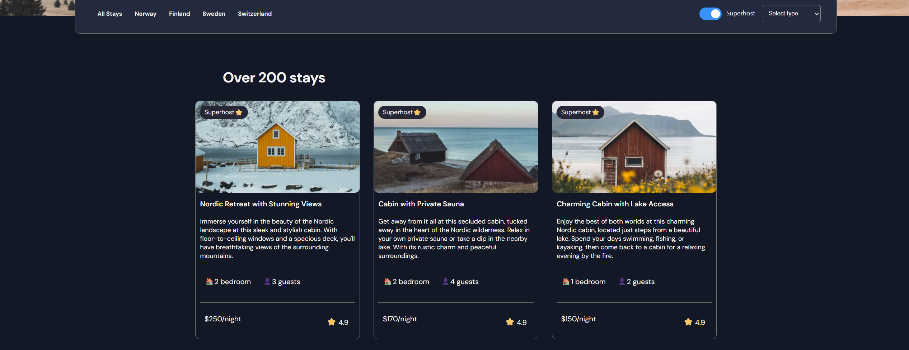

# 🏠 Property Listing App

Property Listing App is a React web application that allows users to browse and view properties.  
This project is designed to showcase React skills, component architecture, state management, and responsive design.

---

## ✨ Features

- Browse a list of properties with details
- Filter properties by superhost feature, bedroom number or location 
- Responsive design for mobile and desktop
- Modular, reusable React components
- Clean and modern UI

---

## 🛠️ Tech Stack

- React
- JavaScript (ES6+)
- CSS / CSS Modules / Tailwind CSS
- State management (useState, useEffect)
- Component-based architecture
- React Router for navigation
- Git & GitHub

---

## 📸 Screenshots

## 🧠 What I Learned

- Building modular and reusable React components
- State management using React hooks
- Passing data between parent and child components via props
- Conditional rendering and filtering
- Responsive UI design
- Handling dynamic lists and mapping data

--- 

## 🔮 Possible Improvements

- Add search and advanced filtering
- Integrate backend for dynamic data
- Add pagination or infinite scroll
- Implement user authentication
- Add animations or transitions for better UX

---

## 🚀 Live Demo

Frontend: (https://property-listing-flax.vercel.app/)

---

## 👤 Author

Anka Knežević 

Junior Frontend / Full-Stack Developer

GitHub: https://github.com/anka131
